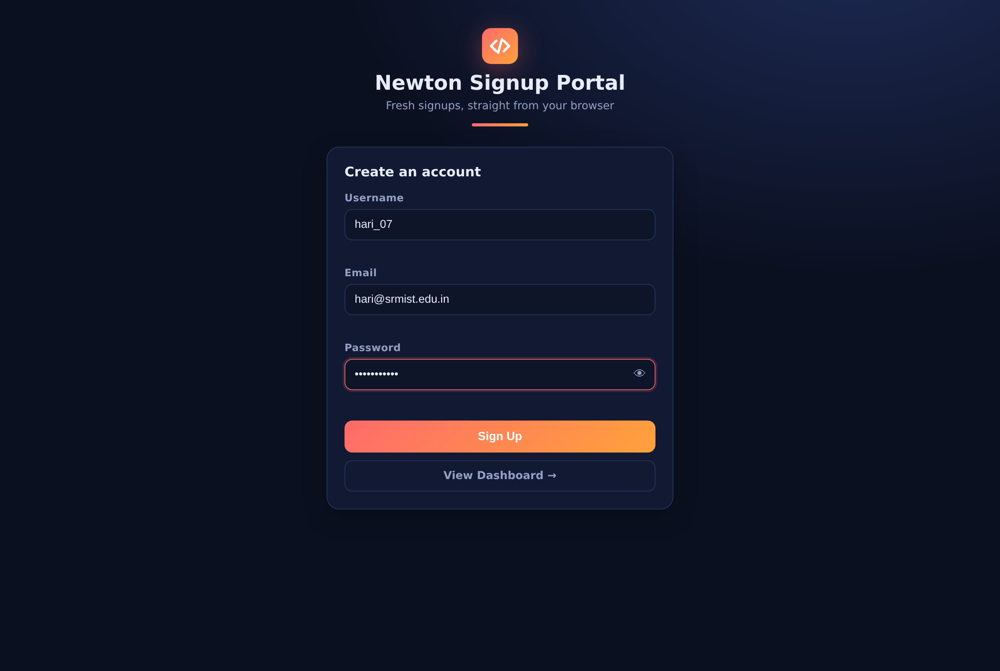
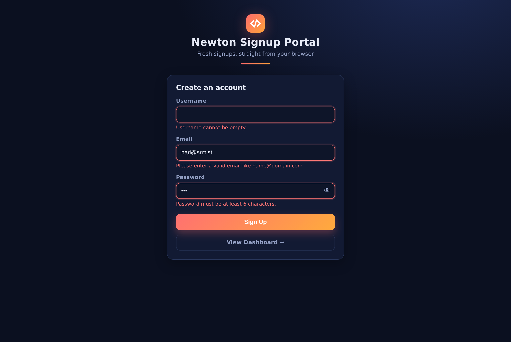
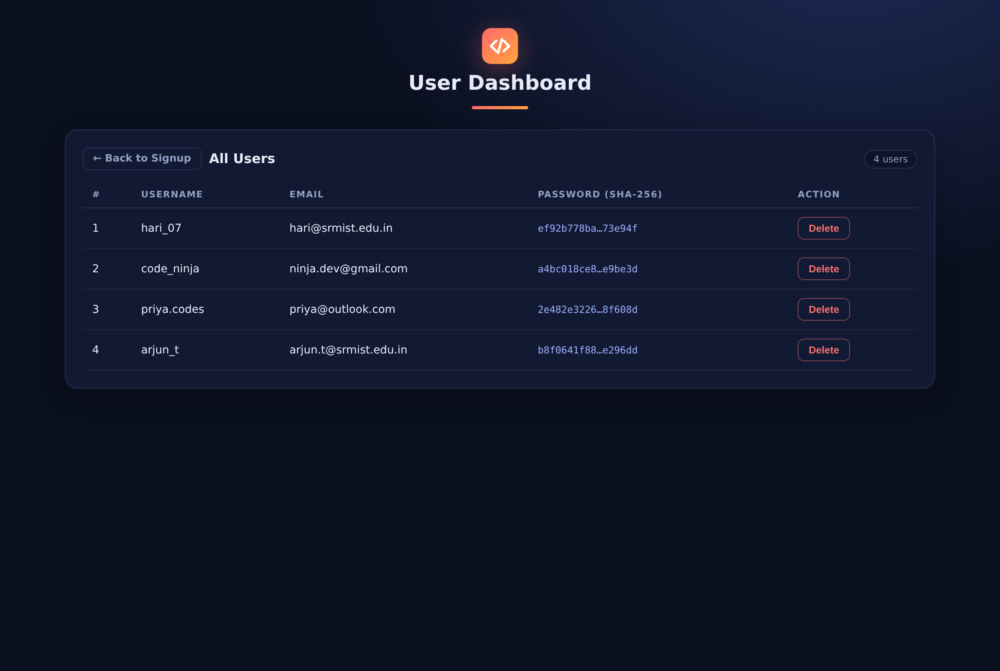

# Task 1 — Signup Form with Validation & Dashboard

A two-page web application built with **pure HTML, CSS and JavaScript** — no
frameworks, no libraries, no build tools.

- **Signup page (`index.html`)** — create an account, with full validation
- **Dashboard page (`dashboard.html`)** — see everyone who signed up, delete entries

Passwords are **hashed with SHA-256** before storage, and all data persists in the
browser's **localStorage**, so users survive page refreshes and navigation.

Built for the **Newton Coding Club (NSCC), SRM KTR** recruitment — 1st-year task.

---

## 🚀 Live Demo

> **➜ LIVE LINK: `PASTE-YOUR-DEPLOYED-URL-HERE`**
>
> Deploy in 2 minutes with [Deployment (GitHub Pages)](#-deployment-github-pages),
> then **replace this line with your URL** before submitting!

## 📸 Screenshots

| Signup page | Validation in action | Dashboard |
|---|---|---|
|  |  |  |

*Tip: hover a row number for the join date, hover a hash for the full SHA-256.*

## ✅ Features implemented (core task)

| Requirement | How it's done |
|---|---|
| Username → cannot be empty | checked after `.trim()`, inline error under the field |
| Email → proper format (regex) | `/^[a-zA-Z0-9._%+-]+@[a-zA-Z0-9.-]+\.[a-zA-Z]{2,}$/` |
| Password → at least 6 characters | `.length` check, inline error under the field |
| Hash the password before storing | SHA-256 via the browser's built-in **Web Crypto API** |
| Store valid details in localStorage | key `ncc_signup_users` — an array of user objects saved as JSON |
| Display users in a table (Username / Email / Password) | dashboard renders every user; the Password column shows the **hash**, never the real password |

## 🍪 Brownie subtask

- **Delete button** on every dashboard row — one shared click listener on the table
  body (**event delegation**), each button carries its row's `data-index`, and
  `Array.splice()` removes that exact user before re-saving and re-rendering.

## ➕ Additional features (beyond the task)

- **Two-page app** with navigation: "View Dashboard →" / "← Back to Signup"
- One shared `script.js` powering both pages using **page guards** (`if (ON_SIGNUP)`)
- Inline per-field error messages that clear as you type
- **Duplicate-email detection** (case-insensitive)
- Show/hide password toggle 👁
- Toast notifications + live user-count badge
- **XSS-safe rendering** — user data is rendered with `textContent`, never `innerHTML`
- Graceful fallback to in-memory storage if localStorage is blocked (with a warning banner)
- Responsive layout — the table and form adapt to small screens

## 🖥️ How to run

No installation, no build step — any modern browser (Chrome / Edge / Firefox) works.

| Way | Steps |
|---|---|
| **Double-click** | open `index.html` — that's it |
| **VS Code** | install the *Live Server* extension → right-click `index.html` → *Open with Live Server* |
| **Terminal** | `python3 -m http.server 8000` in this folder → visit `http://localhost:8000` |

**Environment setup:** none required. Python 3 is optional (only for the terminal
method above). No environment variables, no secrets, no API keys.

## 🌍 Deployment (GitHub Pages)

1. Push this folder to your **public** GitHub repository (see structure below).
2. Repo → **Settings → Pages** → Source: *Deploy from a branch* → Branch: `main`,
   Folder: `/root` → **Save**.
3. Wait ~1 minute and refresh — GitHub shows your live URL:
   `https://<your-username>.github.io/<repo-name>/task-1-signup-dashboard/`
4. Paste that URL into the **Live Demo** section at the top of this README. ✅

*It's a fully static site, so Netlify Drop (drag & drop the folder at
netlify.com/drop) works as an alternative.*

## 📁 Folder structure

```
task-1-signup-dashboard/
├── index.html       # signup page (form + validation)
├── dashboard.html   # dashboard page (users table + delete)
├── style.css        # shared styles for both pages
├── script.js        # shared logic: validation, SHA-256 hashing, localStorage, rendering
├── README.md        # this file
└── assets/          # screenshots
```

## 🧠 Concepts I learned while completing this task

- Writing and *reading* a real **regex** for email validation, piece by piece (`^`, character classes, `+`, `{2,}`, `$`)
- Why passwords must be **hashed**, never stored in plain text — and that SHA-256 is a one-way function
- Using the **Web Crypto API** (`crypto.subtle.digest`) and why that means handling **async/await** and Promises
- **localStorage**: it stores only strings, so `JSON.stringify` / `JSON.parse` are needed — and why both pages share the same storage (same origin)
- **DOM manipulation & events** — selecting elements, listening for `submit`, and `event.preventDefault()` to stop the default form reload
- **Event delegation** — one listener on the table body handles all current *and future* delete buttons
- Why `textContent` is safer than `innerHTML` (**XSS** — user input can't inject HTML or scripts)
- Organizing one shared script across two HTML pages with **page guards**
- CSS variables, flexbox and responsive breakpoints for the layout

## 🔮 Future improvements

- A **login page** that re-hashes the entered password and compares it to the stored hash
- **Salting** + a slow hash (bcrypt/argon2) — which in a real product belongs on a server
- A real backend database + API instead of localStorage
- Edit-user feature and search/filter in the dashboard
